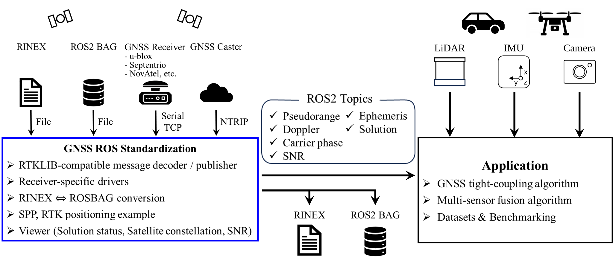
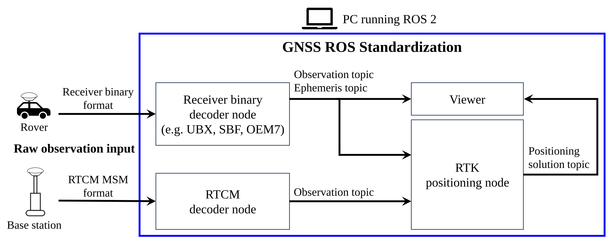

# gnss_ros_standardization

[](LICENSE)
[](https://docs.ros.org/en/humble/)

## Overview

<p align="center">
  
</p>

**gnss_ros_standardization** is an open-source ROS 2 package that standardizes
GNSS raw-data handling for robotics and autonomous systems.

The goal is to make GNSS raw observations and ephemeris uniformly accessible
across receiver brands so that tight-coupling GNSS/IMU methods and multi-sensor
fusion frameworks can be developed once and reused everywhere.

- Subscribe to raw GNSS observations via standardized ROS 2 topics in robotics applications
- Support diverse GNSS receivers and formats (u-blox, Septentrio, NovAtel, RTCM3)
- Reproduce experiments across systems with consistent interfaces

## Demo

Hardware and ROS 2 node configuration used in the demo:

<p align="center">
  
</p>

Demo of real-time kinematic (RTK) positioning using this ROS 2 package:

<p align="center">
  
</p>

## Supported ROS 2 distributions

| Distribution | Ubuntu | Status |
|---|---|---|
| Humble Hawksbill (LTS) | 22.04 | Supported |
| Jazzy Jalisco (LTS) | 24.04 | Supported |

## Supported receivers (summary)

| Receiver | Observations | Ephemeris | NMEA Solution | IMU measurement |
|---|---|---|---|---|
| u-blox (UBX) | ✓ | ✓ | ✓ | ✓ |
| Septentrio (SBF) | ✓ | ✓ | ✓ | ✓ |
| NovAtel (OEM4/6/7) | ✓ | ✓ | ✓ | ✓ |
| RTCM3 (MSM4/7) | ✓ | ✓ | — | — |

Per-receiver protocol message tables (UBX message IDs, SBF block IDs,
NovAtel log IDs, RTCM types) are shown in the component READMEs.

## Dependencies

- **OS**: Ubuntu 22.04 (Humble) or 24.04 (Jazzy)
- **ROS 2**: Humble or Jazzy
- **Build tool**: `colcon`
- **ROS packages** (installed via `rosdep`):
  `rclcpp`, `rcutils`, `std_msgs`, `geometry_msgs`, `sensor_msgs`, `nav_msgs`,
  `builtin_interfaces`, `rosbag2_cpp`, `rosbag2_storage`, `cv_bridge`,
  `image_transport`
- **System libraries**: Eigen3 ≥ 3.3 (`sudo apt install libeigen3-dev`)
- **Third-party** (vendored as a git submodule):
  [RTKLIB (rtklibexplorer fork)](https://github.com/rtklibexplorer/RTKLIB)
  — RTKLIB by T. Takasu, demo5 fork by T. Everett (BSD 2-Clause)
- **Optional** — only for the opt-in tightly-coupled FGO examples
  (`-DBUILD_GTSAM_FGO_EXAMPLES=ON`): [GTSAM](https://github.com/borglab/gtsam)
  (develop branch, BSD-3-Clause).

## Installation

```bash
git clone --recursive https://github.com/DaikiNiimi/gnss_ros_standardization.git
cd gnss_ros_standardization
rosdep install --from-paths . --ignore-src -r -y
colcon build
source install/setup.bash
```

If you cloned the repository without `--recursive`, make sure to run `git submodule update --init --recursive`.

### Optional: tightly-coupled FGO examples (GTSAM)

The [tightly-coupled FGO examples](examples/tightly_coupled_fgo/) (`gnss_fgo`,
`gnss_imu_fgo`) need [GTSAM](https://github.com/borglab/gtsam) built from its
`develop` branch (the GNSS factors are not in a release tag yet). `rosdep`/`colcon`
do not fetch it — build it once:

```bash
git clone https://github.com/borglab/gtsam.git && cd gtsam && git checkout develop
cmake -B build -DCMAKE_BUILD_TYPE=Release \
  -DGTSAM_USE_SYSTEM_EIGEN=ON -DGTSAM_BUILD_WITH_MARCH_NATIVE=OFF \
  -DGTSAM_BUILD_TESTS=OFF -DGTSAM_BUILD_UNSTABLE=OFF -DGTSAM_BUILD_PYTHON=OFF \
  -DCMAKE_INSTALL_PREFIX=$HOME/gtsam-install
cmake --build build -j"$(nproc)" && cmake --install build && cd ..

colcon build --cmake-args -DBUILD_GTSAM_FGO_EXAMPLES=ON \
  -DGTSAM_DIR=$HOME/gtsam-install/lib/cmake/GTSAM
```

`GTSAM_USE_SYSTEM_EIGEN=ON` and `GTSAM_BUILD_WITH_MARCH_NATIVE=OFF` are **required**
(this package uses the system Eigen). The FGO binaries embed the GTSAM path via
RPATH, so no `LD_LIBRARY_PATH` is needed at runtime.

## Components

Each component has its own README with detailed information including message
tables, parameter lists, and `ros2 run` examples.

| Component | Purpose | README |
|---|---|---|
| Decoders | Stream-only: NTRIP / TCP / Serial → ROS topics | [src/decoders/README.md](src/decoders/README.md) |
| Drivers | Connect to receiver, configure outputs, decode | [src/drivers/README.md](src/drivers/README.md) |
| Converters | RINEX ↔ rosbag and RTKLIB `.pos` ↔ rosbag | [src/converter/README.md](src/converter/README.md) |
| Examples | SPP, RTK, loose-coupled GNSS/IMU EKF, tightly-coupled FGO (GTSAM) | [examples/README.md](examples/README.md) |
| Messages | Public ROS message contract | [msg/README.md](msg/README.md) |
| Tests & tools | Unit tests, and checks for a converted rosbag against its source files | [test/README.md](test/README.md) |

## Acknowledgements

This project uses [RTKLIB (rtklibexplorer fork)](https://github.com/rtklibexplorer/RTKLIB),
maintained by Tim Everett, based on [RTKLIB](https://github.com/tomojitakasu/RTKLIB)
by Tomoji Takasu, licensed under BSD 2-Clause.

The tightly-coupled FGO examples build on [GTSAM](https://github.com/borglab/gtsam)
by the Borglab (Frank Dellaert et al.), licensed under BSD-3-Clause, using its
[official GNSS double-difference factors](https://gtsam.org/2026/06/10/rtk-gnss-double-difference.html).

## License

Released under the [MIT License](LICENSE).

## Contact

Maintainer: Daiki Niimi (daiki.niimi@ruri.waseda.jp)
