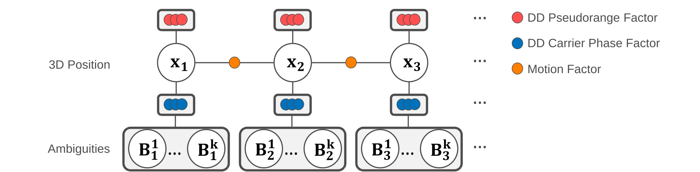
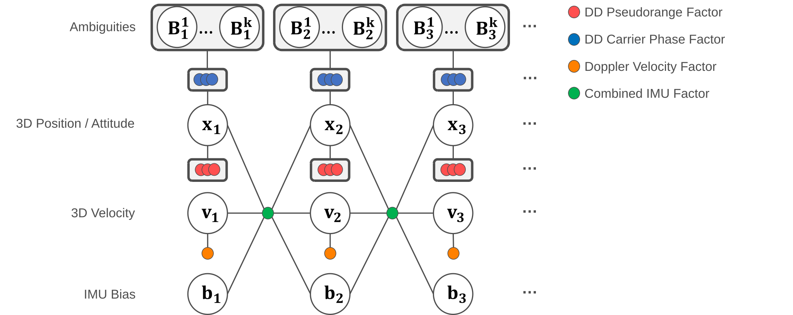

# Tightly-coupled GNSS / GNSS-IMU factor-graph optimization

RTK positioning expressed as incremental factor-graph optimization. Raw
double-difference (DD) pseudorange and carrier-phase measurements are fed
directly into [GTSAM](https://gtsam.org)'s official GNSS factors
([introduced June 2026](https://gtsam.org/2026/06/10/rtk-gnss-double-difference.html))
and optimized with ISAM2; integer ambiguities are resolved on the graph
posterior with RTKLIB's `lambda()` (LAMBDA) and a ratio test, producing **FIX**
solutions.

These are **examples**: they show how to represent the RTK problem in a factor
graph, not a replacement for a dedicated RTK engine. Because the factor graph
consumes the *same* rover/base observations as a classical RTK filter, it does
not add information — the goal is to match a well-tuned RTK filter, not to beat
it. Fix rate and accuracy are dataset- and configuration-dependent and must be
reported against external truth, not against another estimator. Real-time
operation relies on the fixed-lag window (see "Real-time" below).
The IMU node is the heavier of the two (extra pose/velocity/bias states) and
depends on IMU calibration and static initialization, so treat it as
experimental (see its section).

`GnssPreprocessor` (this package, no GTSAM dependency) does all the GNSS-domain
work — rover/base epoch matching, satellite positions, masks, DD pairing — so the
actual tight coupling is the factor construction in
[factor_adapters.hpp](factor_adapters.hpp). The two nodes here share it:
`gnss_fgo` (GNSS only) and `gnss_imu_fgo` (adds IMU preintegration).

The opt-in GTSAM build is described in the
[repository README](../../README.md#optional-tightly-coupled-fgo-examples-gtsam).
Set the base-station position in the YAML — it is **required**; an error there
translates the whole estimated trajectory.

## How ambiguities are resolved

One single-difference (SD) carrier ambiguity per `(satellite, band)` is a graph
state, carried across epochs and re-keyed only on a cycle slip or outage, so the
carrier phase accumulates. Integers are resolved on the **graph posterior**,
mirroring RTKLIB's `resamb_LAMBDA` (which fixes on the full filter posterior —
position *and* the carried ambiguities with their joint covariance). Each epoch:

1. The motion / IMU factors and this epoch's code + carrier DD blocks are added
   to the graph. Every block is a grouped factor with the full covariance of DDs
   sharing a reference satellite, so graph optimization and AR use one
   likelihood (including the same robust policy).
2. The stage-2 joint posterior `[position, N...]` (or
   `[pose, velocity, bias, N...]`) is extracted directly from the graph.
   LAMBDA receives `a_float` and `Qa` projected from this posterior; there is no
   second GLS float estimator.
3. A correlated pre-fit innovation global test performs subset exclusion before
   graph insertion. LAMBDA + ratio/position gates then select integers and the
   full state is conditioned exactly once with
   `Q_state,a Qa^-1 (a_float - a_fix)`. Accepted integers are held as gauge-free
   relative constraints only after pair-specific consecutive confirmation and
   cycle-closure checks; a mismatch rolls back the affected component.

This is what lets σ(N) fall over the arc so the ratio test passes at RTKLIB
rates — a single-epoch AR (float ambiguities re-estimated from one epoch) cannot
get there. A cycle slip / outage re-keys the ambiguity, which then re-locks
within an epoch or two; dual-frequency (L1+L2) makes slip detection and
re-locking far more reliable and is recommended.

The grouped factor's covariance has the reference single-difference variance in
every off-diagonal entry. `measurement.base_correlation_model` additionally
controls temporal base reuse: `variance_inflation` multiplies the reused-base
part by `measurement.base_reuse_factor` (use about 5 for a 1 Hz base reused by a
5 Hz rover), while `independent` disables this conservative correction. This
matches the effective information count for repeated equal measurements, but it
is not a literal cross-epoch block covariance.

CMC is used only to initialize a new ambiguity value. The graph is made
observable by one data-independent zero-mean gauge constraint per connected
ambiguity component; changing the CMC initializer therefore cannot act as an
extra measurement or change an already-defined DD posterior.

**Real-time (fixed-lag).** The estimator is a
`gtsam::IncrementalFixedLagSmoother` — ISAM2 plus marginalization of variables
older than `graph.lag_s`. Full-history ISAM2 grows the per-epoch solve cost
without bound (measured: 1 ms rising past 130 ms over a 3-minute run), so once
it exceeds the input period it drops epochs and the fix rate collapses. The
fixed-lag window makes the steady-state cost **bounded** (flat vs. epoch index)
so the node keeps up in real time. Marginalizing an old position folds its
ambiguity-constraining information into a prior on the retained ambiguities, so
**the carrier keeps accumulating and the current-epoch AR is unchanged** — the
window only has to be long enough that a position is marginalized *after* its
ambiguities are firmly held (too short a window marginalizes not-yet-converged
states over-confidently and admits false fixes). `graph.lag_s <= 0` selects
full-history ISAM2 (unbounded; offline / maximum accuracy). The retained graph
uses **QR** factorization (`ISAM2Params::QR`, not the default Cholesky, which
factors JᵀJ and loses definiteness on the ill-conditioned carrier graph). Each
node logs its per-epoch solve time (`solve: this/max ms`) and warns if it
exceeds the input-period budget on constrained hardware.

**These examples are validated offline and solo, not as a hard-real-time
guarantee.** At the shipped defaults `gnss_imu_fgo` does keep up with a 5 Hz
rover: measured publish latency per epoch on PPC nagoya_run1 is **median 0.41 s,
p90 0.58 s, p99 1.89 s**, and `gnss_fgo` is comfortable on the same course.

**`graph.lag_s` is an accuracy-versus-latency knob, and the latency half is
steep.** Solve cost is very nearly linear in the number of poses in the window:
holding the double-difference count at 29–30, ISAM2's `update()` costs 12 ms at
6 % window occupancy and 237 ms at 100 %. Past the epoch period the node cannot
recover — one dense-sky stretch builds a backlog that persists for minutes. On
nagoya_run1, same build, same data:

| `graph.lag_s` | fix | p05 | epochs solved | latency median | p90 | p99 |
|---|--:|--:|--:|--:|--:|--:|
| 25 (default) | 60.35 % | 71.74 | **7596** | 0.41 s | **0.58 s** | **1.89 s** |
| 40 | 62.18 % | 73.01 | 7520 | 0.47 s | 32.4 s | **58.8 s** |

The extra 1.8 points of fix rate costs 76 epochs that never get a solution and
puts **more than a tenth of the output over half a minute late** — and the
median stays healthy throughout, so only the upper percentiles reveal it. Not a
trade a real-time node should take by default, so 25 s is what ships and what
the evaluation runs. Without ambiguity resolution the accuracy argument reverses
as well: at 25 s the tight percentiles are better (p03 14.26 vs 12.68, p05 30.06
vs 28.57), while the longer window only helps the tail. Raise it only if your
application genuinely prefers a late, better answer.

Within a solve the cost is concentrated in **ISAM2's own `update()` (≈72 %)**,
with the joint [pose, velocity, bias] + ambiguity marginal a further 14 %.
`relinearizeSkip` is not a useful lever: raising it from 1 to 10 saves ~9 % of
the solve and costs ~3 points of fix rate.

Because the node can still fall behind on a hard course, `gnss_imu_fgo` runs
observation intake, IMU intake and the solver on **three separate callback
groups**, with the solve driven by a 10 ms timer rather than inline in the
subscription callback, and a bounded number of epochs per tick so the solver
lock is handed back regularly. Intake therefore keeps recording arrivals while a
solve is in progress, which lets the node tell *"no observation exists"* from
*"the observation is queued behind me"*.

Gaps are bridged from two independent triggers, so availability does not depend
on the node keeping up: the rover going silent in **arrival** (live outage), and
a hole in the **emitted epoch stream** (the next epoch is more than an interval
past the last — direct evidence no observation exists for the slots between,
since the matcher emits in time order and refuses anything below its floor).
Synthesized slots are published in time order ahead of the epoch that revealed
the hole, and never take a slot already published.

Run each node alone. Concurrent nodes or a build contend for the CPU, and a node
that falls behind loses base epochs to the matcher queue, which the evaluation
harness reports rather than hides.

The default windows differ (`gnss_fgo` 60 s, `gnss_imu_fgo` 25 s): the GNSS-only
poses are only weakly tied together (Doppler motion), so they need a longer
window to marginalize consistently, whereas the IMU factors constrain the poses
strongly (consistent sooner) and the heavier Pose/Vel/Bias state needs the
smaller window to stay real-time.

## AR safety parameters and fixed constants

High-impact AR acceptance settings are YAML-exposed and must be recorded with
evaluation results. Lowering them trades integrity for FIX rate.

| Constant | Value | Meaning |
|---|---|---|
| Huber robust kernel | on, k = 1.345, **per group** | `gtsam::noiseModel::Robust` on every DD / motion factor: one weight `w = min(1, k/‖z‖)` per grouped DD factor |
| elevation weighting | on (1/sin el) | measurement-noise scaling |
| `measurement.iono_model` / `trop_model` | `brdc` / `saas` | BRDC ionosphere and Saastamoinen troposphere corrections |
| `measurement.base_correlation_model` | `variance_inflation` | covariance treatment for a reused base epoch |
| `measurement.base_reuse_factor` | 1 | effective number of rover epochs sharing one base observation |
| `init_sigma_cycles` | 20 | loose prior on a new / re-keyed ambiguity (fixes the per-group gauge) |
| `hold_sigma_cycles` | 0.03 | held integer DD constraint, applied **once** per arc — RTKLIB's `varholdamb` re-applies 0.316 every epoch, which converges to about this |
| `fde_nsigma` / `ambiguity.fde_max_exclude` | 4 / 2 | correlated pre-fit innovation test and its exclusion budget. On budget exhaustion the whole set is re-tested at an independent code position |
| `ambiguity.partial_max_drop` | 5 | subset-retry budget for partial AR |
| `ambiguity.min_lock` | 5 | epochs an arc must be carried before it may be fixed |
| `ambiguity.max_pos_var_m2` | 0.25 m² | skip AR when the float has not converged (RTKLIB `pos2-arthres1`) |
| escape gate 1 | 0.08 m / 5 epochs | reject the fix when the CODE double differences disagree with the integer correction for several consecutive epochs (`codeResidualGrowth`) |
| escape gate 2 (`gnss_imu_fgo`) | 2.5 m / 3 epochs | reject when the FLOAT itself sits where the code says the antenna is not (`codeResidualRms`). Covers gate 1's blind spot, where a confident IMU drags the float along with the fix |
| `ambiguity.hold_refresh_s` | 30 s | re-key an arc at this age (0 = never), so an unverified held integer cannot persist indefinitely. Doubles as a fading memory on accumulated model optimism |
| `noise.doppler_max_res_m` | 2.0 | reject the Doppler aiding above this post-fit LS residual RMS [m/s]; epoch-level (0 = off) |
| `noise.doppler_max_nsigma` / `doppler_sigma_mps` | 4.0 / 0.1 m/s | **per-satellite** Doppler fault detection: a Baarda w-test on each residual against its own standard deviation |
| post-fit FIX validation | `R − Ŝ R − R Ŝᵀ + H·P⁺·Hᵀ` | the residuals are evaluated at the integer-conditioned position, which was estimated *from the rows being tested*, so the covariance SHRINKS below the measurement noise. Rank-deficient by construction, so it is inverted on its column space and compared against a χ² quantile at that **rank**. `R` is the true noise and `Ŝ = H·P⁺·Hᵀ·W` carries the robust weights the graph actually applied — fail-closed if they cannot be reproduced |
| escape anchor | code-DD WLS, then SPP | the re-anchor target and the budget-exhausted pre-fit retest reference must be a position no carrier ambiguity can move. NOT `rover_ecef_apriori`, which is a copy of the node's own previous estimate |
| AR elevation mask | `masks.elevation_deg` | reused for the LAMBDA satellite set |
| CMC / Doppler slip | on, 3.0 m / 1.0 cyc | always-on cycle-slip detectors |
| GLONASS carrier DD | off | FDMA biases do not cancel across heterogeneous receivers |
| position prior / motion | 100 m; vel floor 0.1 m/s; gap 5 s | first-epoch anchor + Doppler motion model |
| re-anchor sigma | 10 m (`gnss_fgo`) / 100 m (`gnss_imu_fgo`) | how hard to pull the graph to the code anchor — deliberately not the anchor's own covariance, or the escape would override the carrier phase |
| one-shot heading alignment | σ ≤ 10°, 3 agreeing epochs within 20°, reverse guard 90° / 3 m/s | see "First heading of a run" below |
| ISAM2 (`gnss_fgo`) | QR, relin 0.01, skip 10 | Point3 state, near-linear DD model |
| ISAM2 (`gnss_imu_fgo`) | QR, per-symbol thresholds, skip 1 | the DD model depends on attitude through the lever arm, and preintegration adds its own nonlinearity |
| `imu.max_wait_s` | 0.2 s | sensor-watermark wait; a live outage is handled by a separate watchdog |
| `imu.queue_depth` | 2000 | IMU DDS subscription history depth |

The fixed-lag window is the principal real-time/cost knob; see "Real-time" above.

## Parameter reference

Every YAML key both nodes read, with its unit and default. Keys marked **IMU**
exist only in `gnss_imu_fgo`.

### Topics and frames

| Key | Default | Meaning |
|---|---|---|
| `topics.rover_observation` | `/gnss/observation` | rover observation input |
| `topics.base_observation` | `/base/gnss/observation` | base observation input |
| `topics.ephemeris` | `/gnss/ephemeris` | broadcast ephemeris input |
| `topics.solution` | `/gnss/fgo/solution` | solution output |
| `topics.imu` **IMU** | `/gnss/imu/data_raw` | IMU input |
| `base_position.postype` / `.pos` | `llh` / `[0,0,0]` | base antenna position; `llh` is deg/deg/m, `xyz` is ECEF metres |
| `fixed_origin.postype` / `.pos` | `llh` / `[0,0,0]` | ENU origin for the published local frame |
| `local_origin.mode` **IMU** | `gnss_fix` | ENU origin source: `gnss_fix` (first fix) or `fixed` |
| `local_origin.postype` / `.pos` **IMU** | `llh` / `[0,0,0]` | origin used when `mode: fixed` |
| `lever_arm` **IMU** | `[0,0,0]` | IMU body (FLU) to antenna, metres |

### Constellations, signals and masks

| Key | Default | Meaning |
|---|---|---|
| `navsys.gps` / `.gal` / `.bds` / `.qzs` | `true` | use this constellation |
| `navsys.glo` | `false` | use GLONASS |
| `navsys.glo_undifferenced_only` | `false` | keep GLONASS for the code solution but exclude it from ambiguity resolution |
| `frequencies.enable_l1` / `.enable_l2` | `true` | use this band |
| `frequencies.enable_l5` | `false` | use L5 / E5a / B2a |
| `frequencies.cross_code_pairing` | `true` | allow rover and base to use different tracking codes on the same band |
| `masks.elevation_deg` | 15.0 | elevation mask, degrees |
| `masks.snr_dbhz` | 0.0 | carrier-to-noise mask, dB-Hz; 0 disables |
| `excluded_satellites` | `[]` | satellite IDs to drop, e.g. `["G05"]` |

### Measurement model and noise

| Key | Default | Meaning |
|---|---|---|
| `noise.pr_sigma_m` | 0.5 | pseudorange standard deviation, metres (zenith; elevation-weighted) |
| `noise.cp_sigma_m` | 0.005 | carrier-phase standard deviation, metres |
| `noise.pr_innov_gate_m` | 0.0 | pre-fit pseudorange innovation gate, metres; 0 disables |
| `noise.doppler_max_res_m` | 2.0 | Doppler residual rejection threshold, metres/s (whole epoch) |
| `noise.doppler_max_nsigma` | 4.0 | per-satellite Baarda w-test inside the Doppler solve; 0 disables |
| `noise.doppler_sigma_mps` | 0.1 | a-priori zenith range-rate sigma, m/s (sets the velocity covariance scale) |
| `noise.doppler_corr_time_s` **IMU** | 2.0 | Doppler error correlation time, seconds |
| `motion.accel_sigma_mps2` | 3.0 | process noise of the constant-velocity motion factor, m/s² |
| `max_age_s` | 5.0 | oldest base epoch accepted for a double difference, seconds. Also the epoch matcher's pairing window: pairing a rover with a base the DD stage will refuse leaves that base at the head of the queue, where it is re-selected for every following rover |
| `cycle_slip.gf_threshold_m` | 0.05 | geometry-free slip threshold, metres |
| `cycle_slip.max_gap_s` | 2.0 | carrier gap that forces a slip, seconds |

### Ambiguity resolution

| Key | Default | Meaning |
|---|---|---|
| `ambiguity.resolution` | `true` | resolve integers; `false` publishes FLOAT only |
| `ambiguity.ratio_threshold` | 3.0 | LAMBDA ratio test threshold |
| `ambiguity.min_fix` | 4 | minimum ambiguities required to attempt a fix |
| `ambiguity.min_lock` | 5 | epochs an arc must be carried before it may be fixed |
| `ambiguity.min_fix_to_hold` | 10 | consecutive fixes before an integer is held |
| `ambiguity.hold_refresh_s` | 30.0 | re-key an arc at this age; 0 never |
| `ambiguity.max_outage_s` | 5.0 | carrier outage after which arcs are dropped, seconds |
| `ambiguity.fde_max_exclude` | 2 | maximum double differences the pre-fit test may exclude per epoch |

### IMU, attitude and vehicle constraints (`gnss_imu_fgo` only)

| Key | Default | Meaning |
|---|---|---|
| `imu.sigma_acc` / `.sigma_gyr` | 0.3 / 0.01 | accelerometer / gyroscope noise density, m/s²/√Hz and rad/s/√Hz |
| `imu.sigma_acc_bias` / `.sigma_gyr_bias` | 1e-5 / 1e-6 | bias random walk, m/s²/√s and rad/s/√s |
| `imu.sigma_integration` | 0.01 | preintegration position-integration noise |
| `imu.max_wait_s` | 0.2 | how long an epoch waits for IMU coverage, seconds |
| `imu.queue_depth` | 2000 | IMU subscription queue depth |
| `attitude.velocity_aiding` | `true` | constrain heading to the direction of travel |
| `attitude.min_speed_mps` | 3.0 | speed above which velocity aiding applies, m/s |
| `attitude.sideslip_deg` | 2.0 | assumed side-slip, degrees |
| `attitude.max_misalign_deg` | 90.0 | heading disagreement above which aiding is refused, degrees |
| `nhc.enable` | `false` | non-holonomic constraint |
| `nhc.sigma_lat_mps` / `.sigma_vert_mps` | 0.3 / 0.2 | lateral / vertical velocity constraint sigma, m/s |
| `nhc.min_speed_mps` | 0.0 | speed above which NHC applies, m/s |
| `nhc.max_yaw_rate_rps` | 0.02 | yaw rate above which NHC is skipped, rad/s |
| `nhc.lever_frd` | `[0,0,0]` | IMU to constraint point (FRD), metres |
| `zupt.enable` | `true` | zero-velocity update at standstill |
| `zupt.max_speed_mps` | 1.0 | speed below which ZUPT may apply, m/s |
| `zupt.max_acc_std` / `.max_gyr_std` | 0.55 / 0.030 | stillness detector thresholds, m/s² and rad/s |
| `zupt.max_gyr_median` | 0.020 | stillness detector median gyro threshold, rad/s |
| `zupt.min_samples` | 5 | IMU samples required to declare stillness |
| `zupt.sigma_mps` / `.sigma_vert_mps` | 0.5 / 0.5 | horizontal / vertical ZUPT sigma, m/s |
| `gap.max_coast_s` | 30.0 | longest dead-reckoned stretch published during a GNSS outage, seconds; 0 disables the bound |

### Solver and debug

| Key | Default | Meaning |
|---|---|---|
| `graph.lag_s` | 60.0 (`gnss_fgo`) / 25.0 (**IMU**) | fixed-lag smoother window, seconds; <= 0 keeps full history |
| `time.gnss_epoch_source` **IMU** | — | `header` or `tow_auto_offset` |
| `debug.ar_dump_dir` | `""` | directory for the AR diagnostic CSVs; empty disables. Leave empty in production - the files grow without bound |

## Inspecting the ambiguity resolution

Set `debug.ar_dump_dir` (empty = off) and both nodes write, per epoch, the state
LAMBDA actually decided on: the float antenna position and its covariance, the
float DD ambiguities `a_float`, and their covariance `Qa` — alongside the
resulting ratio and integers.

The epoch CSV labels a FLOAT produced while integer holds are active as
`hold_conditioned_float`; it is not a pure unfixed FLOAT.

The IMU node also writes fallback count, maximum IMU gap, received/DDS-lost
counts, and solve time to `gnss_imu_fgo_imu_diagnostics.csv`.

A wrong fix has two very different causes — a **biased float** or an
**over-confident covariance** — and the ratio test cannot separate them, being
computed from that same covariance. With a truth trajectory they do separate:
recover each DD's true integer from the truth position, form
`eps = a_float - N_true`, and test `eps' Qa^-1 eps` against chi-square. A median
`chi2/k` near 1 means `Qa` is honest.

### The two graph-independent positions in the dump

Every other position in the epoch CSV — float, fixed, graph — is a function of
the graph state, so a wrong fix is *self-consistent* with all of them. Fix-and-
hold is a closed loop: a biased float biases the AR prior, the accepted integers
are held, the holds bias the graph, and the next float is biased further. Any
statistic built from the posterior is made of the thing it is supposed to judge.

Two columns break out of that loop, because no carrier ambiguity appears in
either quantity:

| Column | Source | Typical disagreement with the graph float |
|---|---|---|
| `spp_*` | standalone single-point fix (`PreprocessedEpoch::rover_ecef_spp`) | median 3.7 m, p95 10.9 m |
| `ddwls_*` | code double-difference WLS (`solveCodeDdWls`) | median 0.48 m, p95 1.3 m |

`ddwls` is the tighter yardstick because differencing against the base cancels
ionosphere, troposphere, orbit and satellite-clock error; SPP keeps all of them.
That decides whether a disagreement statistic can reach the band where false
fixes live (0.25–1 m) without averaging over a long window, and a long window is
a slow escape.

`solveCodeDdWls` is fed the **raw** epoch, never the pre-fit-filtered one: that
filter gates DDs against the predicted state, which is the state under suspicion.
It runs its own Baarda w-test, normalizing each residual by its own standard
deviation rather than the measurement's — least squares absorbs part of a blunder
into the position, so the measurement sigma hides exactly what is worth catching.

**`rover_ecef_apriori` is NOT independent in these nodes.** Both pass their own
last estimate to `drainEpochs`, so it comes back as a copy of the previous graph
float. Use `rover_ecef_spp` or `solveCodeDdWls` when independence matters.

## `gnss_fgo` — GNSS only

<p align="center"></p>

The rover position is carried across epochs by a Doppler-derived motion factor
(a `BetweenFactor<Point3>`, like RTKLIB's EKF dynamics); ambiguities are resolved
on the graph posterior as described above.

```bash
ros2 run gnss_ros_standardization gnss_fgo --ros-args \
  --params-file config/gnss_fgo.yaml
```

This is an example of expressing RTK constraints in a GTSAM factor graph, not a
way to exceed a classical RTK filter. Validate FIX labels against independent
truth; agreement with RTK is not evidence that either solution is correct.

Set `ambiguity.resolution: false` for a **FLOAT-only** run: LAMBDA never runs, no
fix is published and no integer is held. The float solution is what carries the
position whenever AR fails, so scoring it on its own — rather than letting the
fixed epochs average over it — is the honest way to compare estimators. The same
switch exists on `gnss_imu_fgo`; `real_time_kinematic` has `pos2.armode: 0`.

| Direction | Default topic | Type |
|---|---|---|
| Sub | `/gnss/observation` | `GnssObservations` |
| Sub | `/base/gnss/observation` | `GnssObservations` |
| Sub | `/gnss/ephemeris` | `GnssEphemerides` |
| Pub | `/gnss/fgo/solution` | `GnssSolution` |

## `gnss_imu_fgo` — GNSS + IMU (experimental)

<p align="center"></p>

Adds GTSAM IMU preintegration (`CombinedImuFactor`, the variant that models bias
random-walk evolution and the bias/measurement cross-correlation — the plain
`ImuFactor` does not); the DD factors attach to the body pose through the "Arm"
factor variants (lever arm + `ecef_T_nav`). The platform is assumed static for
`init.imu_duration` seconds to initialize attitude (yaw converges once it moves).

The accelerometer / gyro noise densities (`imu.sigma_acc` / `imu.sigma_gyr`) are
deliberately **inflated** over the ADIS16505-2 datasheet — that is standard for a
road vehicle, not a mistake: the effective process noise has to absorb engine /
road vibration and unmodeled dynamics, and a tightly-coupled GNSS solve is
destabilized by an over-confident IMU (a datasheet-tight setting measurably
worsened the full-course fix rate). Only the bias random walks
(`imu.sigma_*_bias`) are datasheet-derived.

**Vehicle-motion constraints (attitude aiding + NHC + ZUPT).** Because this
example excludes wheel odometry, it recovers most of that information from
pure-kinematic pseudo-measurements, all built from stock GTSAM factors (no custom
classes) in [imu_factors.hpp](imu_factors.hpp). They differ in **kind**, and that
turned out to matter far more than their tuning:

- **Velocity-direction attitude aiding** — **on by default**: a wheeled vehicle
  points where it is going, so body **+x** is parallel to the GNSS Doppler
  velocity. A stock `gtsam::AttitudeFactor<Pose3>` with `nRef` = the velocity
  direction and `bMeasured` = body +x. It is the **only** constraint tying body
  heading to direction of travel; without it yaw is observable solely through the
  IMU factor's "velocity change vs `R·(a − b_a)`" consistency, which separates
  yaw from horizontal accelerometer bias only while the *direction* of horizontal
  acceleration changes. σ comes from the velocity uncertainty (`σ_vel / speed`)
  with a side-slip floor, not tuning. Skipped below `attitude.min_speed_mps` and
  beyond `attitude.max_misalign_deg` (reverse driving reads ~180°).
  > **Platform assumption.** Requires a **wheeled vehicle**: small side-slip,
  > body +x along the direction of travel, no sustained reverse. Set
  > `attitude.velocity_aiding: false` for aircraft, boats, or handheld/backpack
  > use. The node logs the assumption once at startup when enabled.
- **ZUPT** (zero-velocity update) — **on by default**: a stationarity test on the
  epoch's IMU window (acceleration / angular-rate dispersion + bias-corrected
  rate magnitude) pins `V_k` to 0 through a `PriorFactor<Vector3>` while stopped.
  **Evidence-gated** by the current velocity estimate (`zupt.max_speed_mps`,
  default 1 m/s): the IMU alone cannot distinguish rest from smooth slow motion
  (traffic creep), so a moving estimate vetoes the pin.
- **First heading of a run.** `alignYawToCourse` replaces the yaw *outright* from
  the course over ground, so it is gated on evidence rather than speed:
  candidates need a **course σ** (`σ_vel/speed`) under 10°, and several
  consecutive candidates must **agree** on the yaw *offset* `course − yaw`.
  Voting on the offset keeps the test usable while manoeuvring, since a constant
  offset survives a turn. A **reversing** vehicle defeats both gates (course is
  exactly 180° from heading, repeatably), so an agreed offset beyond 90° is
  applied only at or above 3 m/s and every candidate in the window must clear it.
- **NHC** (non-holonomic constraint) — **off by default**: the body-lateral and
  body-vertical velocity of a car are ≈ 0. A stock
  `gtsam::ExpressionFactor<Point3>` on `unrotate(rotation(X_k), V_k)` with a
  tight σ on the two constrained axes and a free forward axis. The
  zero-lateral-velocity condition holds at the non-steered (rear) axle, not at
  the IMU: during turns the IMU origin has a real lateral velocity `ω × r`, so
  enforcing it at the IMU (`nhc.lever_frd = 0`) injects a yaw error.
  `nhc.max_yaw_rate_rps` (default 0.02) therefore gates it to **straight driving
  only**, where that term vanishes and the constraint is kinematically exact at
  the IMU regardless of the lever. Enable it — ideally with `nhc.lever_frd` set
  to the real IMU→rear-axle offset — where the route is predominantly straight
  and yaw integrity matters.
  > **Prefer the attitude aiding above.** The NHC states the same physics as a
  > **velocity** constraint, so it also collides with ZUPT at a standstill and
  > with the Doppler prior while moving. It cures the heading but makes the
  > velocity over-confident, and a wrong fix then survives far longer. The
  > attitude factor carries no velocity information, so it cannot do that.
Toggle per-constraint via `attitude.velocity_aiding` / `zupt.enable` /
`nhc.enable`.

**Experimental.** It is more fragile than the GNSS-only node: it carries extra
pose / velocity / bias states, its initialization deliberately emits no solution
until the configured static IMU window is complete, and its per-epoch solve is
heavier (watch solve time and DDS queue loss during bag replay). Accuracy depends
on static initialization and IMU calibration; a poor attitude / yaw init or a
wrong lever arm biases every DD factor and can produce false fixes. Treat it as a
coupling example, not an RTK-equivalent. Before relying on it: set **`lever_arm`**
to the real body→antenna offset (a wrong lever arm injects an attitude-dependent
error into every carrier residual), verify the IMU axis/scale/bias, and confirm
time sync (`time.gnss_epoch_source`).

The IMU subscription callback only timestamps and enqueues samples under a
dedicated lock; a worker drains the buffer for optimization. Missing-data
decisions use the sensor timestamp watermark, so a slow graph solve cannot
manufacture an IMU outage. A separate watchdog handles genuine live-stream
silence.

Time sync caveat: with `time.gnss_epoch_source: tow_auto_offset` the node
estimates the GNSS↔IMU-clock offset as a sliding-window **minimum** of
`stamp − utc(week,tow)`, which strips the variable part of the receiver output
latency but leaves the *constant minimum* latency in place (it cannot be observed
from the stream alone). On the PPC conversion bags this is a non-issue — GNSS and
IMU carry the same GPST stamp — but on a live receiver a residual fixed offset
remains; for tight sync feed a hardware-synchronized time (PPS/PTP) or a measured
`latency` rather than relying on the auto-offset. The gap dead-reckoning also
reports an **approximate** covariance (last-posterior pose + preintegration noise
+ a velocity-over-horizon term; it does *not* propagate the full pose/velocity/
bias cross-covariances), so its uncertainty is a lower bound that grows with the
outage length — adequate for short bridging, not a full INS covariance engine.

```bash
ros2 run gnss_ros_standardization gnss_imu_fgo --ros-args \
  --params-file config/gnss_imu_fgo.yaml
```

| Direction | Default topic | Type |
|---|---|---|
| Sub | `/gnss/observation` | `GnssObservations` |
| Sub | `/base/gnss/observation` | `GnssObservations` |
| Sub | `/gnss/ephemeris` | `GnssEphemerides` |
| Sub | `/gnss/imu/data_raw` | `sensor_msgs/Imu` |
| Pub | `/gnss/imu_fgo/solution` (+ `_odom` full pose/attitude) | `GnssSolution` / `nav_msgs/Odometry` |

**Output-state conventions (two topics, one state).** `GnssSolution` reports the
**antenna** phase centre (ECEF/LLH/ENU); `Odometry` reports the **body** pose
(FLU) with velocity/angular-rate twist in the body frame (REP-105). At a FIX they
represent the *same* integer-conditioned state: the Odometry pose is the
FIX-conditioned body pose reconstructed from the AR's antenna result, and the
`GnssSolution` antenna is derived from it, so `antenna(Odometry pose) ==
GnssSolution.pos` by construction. Because
`nav_msgs/Odometry` has no status field, the pose still steps at a FIX↔FLOAT
transition (its covariance tightens accordingly); this is the usual
"always publish the best estimate" convention. Angular velocity is the
bias-corrected gyro with the gyro-noise covariance (not an authoritative zero).

The GNSS-only `gnss_fgo` publishes **no** solution on an epoch with no double
differences: it is a purely relative (DD) method, so "no DD" means "no solution",
and emitting the code-only SPP a-priori instead would mislead a consumer into
treating a metre-level absolute fix as the FGO output. Availability is therefore
reported against the reference epoch count (a no-DD epoch counts as unavailable),
not flattered by a fallback.